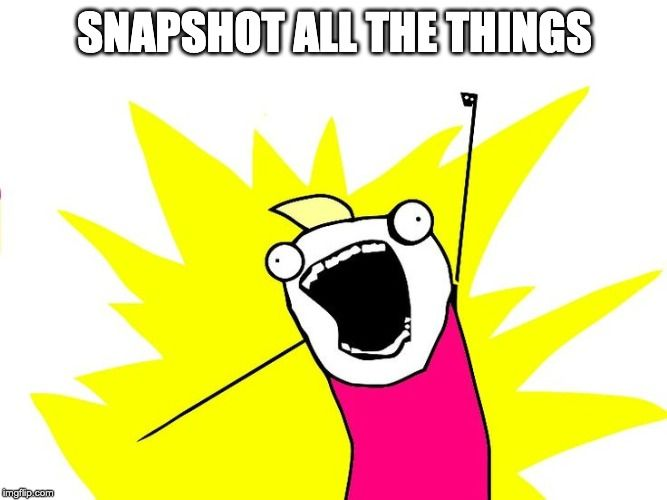

## Understanding Jest Snapshots

Jest, created by Facebook, is a testing framework for react that brings with it a powerful but mysterious tool; That is why it is sometimes feared, ignored or misused.

In this post, we will learn all of it, how to use it in our tests and increase confidence in our code.

## **A quick review of the tests**

What we have developed may be the best and can work correctly when the user interacts with it as we expect, but what happens when not? How do we realise it? Or even when we need to refactor something, how do we make sure that our changes do not harm other parts of the application? Well, with tests.
> *If you are interested in knowing more about tests, ping me on Twitter at [@taverasmisael](https://twitter.com/intent/tweet?via=taverasmisael&text=I%20Want%20to%20learn%20more%20about%20tests%20with%20JavaScript) and let me know.*

To create tests, we need what is known as a *Test framework*, an *Assertion library*, and if we want to get fancy, a code coverage tool.

**Test framework:** is responsible for running our tests in a controlled environment, following a sequence and making sure that our assertions pass.

**Assertion Library:** This library is the one that assumes our code; it allows us to create lines like expect(true).toBe(true) giving us matchers. The matchers are functions that compare two values ​​and throw an error if they’re different from what we expected. Among the matchers that Jest brings are *toBe, toEqual, toHaveLength and **toMatchSnapshot*.**

> *Interesting fact: The javascript console has a simple assertion tool. If we write console.assert(expected,"It's not what I expected"), console will print as an error It's not what I expectedif expected is false; otherwise it'll do nothing. **Test it.***

[Jest](https://jestjs.io/) is a framework created by Facebook that, unlike its predecessors, is an all-in-one with no configuration needed to start. It includes the test framework, the assertion library, even a coverage tool; But more relevant to us now; it introduced the concept of snapshot testing.

## **Snapshots, to simplify the tests**


The tests, as we explained, ensure that the value we expect is the same as the actual value produced by our code. These tests are easy to do when values ​​are simple, such as numbers, strings or booleans; but what happens when the data ​​is more complicated? What do we do when they are objects? What should we do if our state is a big object with many parts? What if we need to ensure that our component shows a particular structure?

> Snapshots are captures of a specific moment or state in our application.

A common way to test the result of a [Redux](https://redux.js.org/) reducer is to make several checks on the different state values. Taking the example that we have a basic state with isLoading, error and data. We want to call the action DO_REQUEST to reset thedata to an empty array, error is a blank string andisLoading is true. The test might look something like:

```ts
import reducer from './reducer'

// Use `describe` to group similar tests
describe('REDUCER', () => {
   // The `it` blocks represent one test and although they can
  // have several expects it is recommended that you only have one
  // or that at least all the expects blocks are related, as in this case.
  it('should set the right state on "DO_REQUEST"', () => {
    const newState = reducer(undefined, { type: 'DO_REQUEST' })
    expect(newState.error).toBe('')
    expect(newState.data).toEqual([])
    expect(newState.isLoading).toBe(true)
  })
})
```

> ***Brief review of Redux: **The reduce function takes a state (in this case undefined to use the default) and an object with atype where we specify the operation to be performed in said state. The reduce function then returns a new state based on thetype that we specify.*

With this method, we have to remember each piece of state that is relevant and, due to the nature of JavaScript, we have to use two different matchers, toBe and toEqual.

Now let’s see the same test, with the same result but using snapshots.

```ts
import reduce from './reducer'

describe ('REDUCER', () => {
  it ('should set the right state on "DO_REQUEST"', () => {
    const newState = reducer(undefined, {type: 'DO_REQUEST'})
    // The `toMatchSnapshot` matcher does not receive any parameters
    // In the next section we will see why
    expect (newState).toMatchSnapshot()
  })
})
```

More straightforward, concise, and I think we can appreciate the value it brings for more complex states right away. A state with more than three keys, or a component that renders a list, it’s just a snapshot, and that’s it.

Let’s look at the snapshots a little more in-depth.

## **The snapshot life cycle**

When we create the snapshots we do it through a Jest *matcher* called toMatchSnapshot (there is a toMatchInlineSnapshot also, that does practically the same thing).

### **Using toMatchSnapshot**

Every time you run our tests, Jest verify that there is a file of the same name as the one where the test is, but with the extension .snap inside the folder **__snapshots__**: (`reduce.test.js -> __snapshots __ / reduce.test.js.snap`)

* The first time, as the file does not exist, Jest will create it for us and use it as the defacto snapshot, running our tests against it.

* Each time, after the first time, the test is run, Jest is expecting that the content of the .snap file has not changed. If the file changes, the test fails.

* If we want to update the snapshot because we have changed something on purpose, we have two options: 1) Press u when we run Jest in Watch mode, or 2) Run the jest --updateSnapshot command directly.

### **Using toMatchInlineSnapshot**

It is similar to the previous one, the only difference is that the snapshot is embedded in the call of toMatchInlineSnapshot instead of being created in a separated file.

```ts
    expect (2 + 2).toMatchInlineSnapshot()
    /* becomes...*/
    expect (2 + 2).toMatchInlineSnapshot('4')
```

### **What a .snap file looks like**

For our reducerexample, the generated snapshot would something like this:

```snapshot
exports [`REDUCER should set the right state on" DO_REQUEST "1`] =`
Object {
  "data": Array [],
  "error": "",
  "isLoading": true,
}
```

## **Good and not so good practices using snapshots**

During the time I have used snapshots for my tests, I discovered that not all ways of using them are beneficial. Here a compilation of the ones I think are more relevant.

### **Do not use snapshots for everything**

Let’s start by evading a trap that is easy to fall into, snapshots of all things.



While it is true that snapshots are fast and light, creating snapshots of everything can get “messy” by having dozens of files with simple snapshots that could be “classic” tests.

Another disadvantage of using snapshots is that the tests stop making sense without seeing the snapshot. This kind of pattern makes difficult for future developers (we included) to understand the intention of the test.

 ```ts
import { render, simulate } from 'test-library-for-react'
import Component from './Component'

describe('my obscure test', () => {
  // This test does not add any value even though it passes
  // and probably meet the code coverage requirement.
  it('should work', () => {
    const component = render(<Component />)
    simulate.click(component.find('button'))
    // Whaaat! No idea what the click was supposed to do
    // Or how he reacted. We must always choose
    // readability above comfort.
    expect(component).toMatchSnapshot()
  })
})
```

### **Snapshots are excellent for complex structures**

As we saw in the first example, snapshots can guarantee a better test when it comes to objects, nested values ​​or components. If you have problems creating a snapshot of a certain structure, look for a serialization package, these are utilities that make snapshots more consistent.

For example, if you do tests using [Enzyme](https://github.com/airbnb/enzyme), you must install the [Enzyme to JSON](https://github.com/adriantoine/enzyme-to-json) package to have snapshots that genuinely demonstrate the structure of the component.

### **Avoid using snapshots for side effects**


Side effects are often unpredictable or beyond the scope of what we are testing. Things like events, API calls, console.logs and so on are considered side effects (**it doesn’t necessarily mean they are wrong**). If you make use of them, snapshots are probably not the right tool for the job.

Taking as an example a click event that you write on the console, it is something that we cannot try with snapshots because they do not run concerning the console.

For a service that calls the API and modifies the result to make it more usable in the application, we can test the result, make sure that the mapping has been correct or that the parameters that we send to the server are right, **but we cannot snapshot a call to the API directly.**

### **Do not make snapshots of third-party libraries**

Our tests should never test the third-party libraries we use, that is a job for the developer of the library

Now, sometimes our component (function, module, etc.) depends on third-party libraries. **We must avoid testing our snapshots against the third party code.**

One time, I spent a few hours debugging a snapshot that always gave differences no matter what. When I could find out what was going on, a Charts library we used added a *hash* to the container ID of each chart, so every time the test ran, the ID was different. What I did was ignore the rendering of this specific library and replace it with a Chart placeholder. It wasn't the responsibility of that test know HOW the graph rendered.

## What are snapshots and what they are not

* Snapshots **are** a useful tool to ensure that our results do not change unexpectedly.

* Snapshots **are** a quick way to test complex UIs or values.

* Snapshots **are** part of our application so they **MUST be committed** as well.

* Snapshots **are** valid for code coverage.

* Snapshots **are not** a replacement for our unit tests.

* Snapshots **are not** slow to generate/validate. Jest uses something similar to Git’s diff to speed up this process.

* The snapshots **are not** suitable for TDD and because the snapshots are designed with the final state in mind, so you should be updating the snapshots at each change.

## **Conclusion**


In this article, we have explored one of the tools we have at hand to create tests easier. **There are no more excuses** for not adding tests to your applications.

> If we eliminate the friction that exists to start creating tests, we are more likely to start doing them.

If you liked the topic and it has helped you, **share it with someone who might be interested**. Not only would this help the person with whom you share it, but it also helps me to know that this is a content of interest.

As I mentioned above, if you want to learn more testing with JavaScripts let me know on [Twitter](https://twitter.com/taverasmisael) or any topic you would like me to cover next, and I will be doing my best to bring it.
