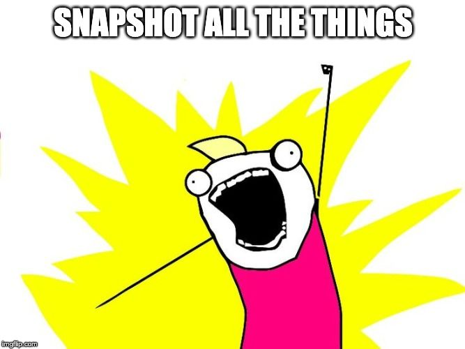

Jest, creado por Facebook, es un framework de testing para react que trae consigo una herramienta poderosa pero misteriosa; por eso a veces es temida, ignorada o mal usada.

En este post aprenderemos todo de ella, cómo usarla en nuestros tests para probar más con menos y aumentar la confianza en nuestro código.

_Si viniste solo por el jugoso tema de los snapshots [da clic acá](#snapshots-para-simplificar-los-tests) para saltarte el repaso._

## Repaso rápido sobre los tests

> Los tests son código que **prueban** código.

Lo que hemos desarrollado puede ser de lo mejor y puede funcionar correctamente cuando el usuario lo usa como esperamos, pero ¿Qué pasa cuando no? ¿Cómo nos damos cuenta? O incluso nosotros cuando necesitamos refactorizar algo, ¿Cómo nos aseguramos que nuestros cambios no dañen otras partes? Pues con tests.

> Si estás interesado en saber más sobre tests, escríbeme en Twitter a [@taverasmisael](https://twitter.com/intent/tweet?via=taverasmisael&text=Quiero%20aprender%20mas%20sobre%20test%20con%20JavaScript) y déjame saber.

Para crear tests necesitamos lo que se conoce como un _Test framework_, una librería de afirmaciones o _Assertion library_ y si queremos ponernos elegantes, un analizador de cobertura de código.

**Test framework:** es el que se encarga de correr nuestras pruebas en un entorno controlado, siguiendo una secuencia y asegurándose de que pasen nuestros asunciones.

**Assertion library:** esta librería es la que hace las asunciones de nuestro código; nos permite crear lineas como `expect(true).toBe(true)` dándonos `matchers` que no son más que funciones que comparan dos valores y lanza un error sin son diferentes. Entre los matchers que trae consigo Jest se encuentran: _toBe, toEqual, toHaveLength y toMatchSnapshot_.

> **Dato interesante**: la consola de javascript tienen una funcionalidad sencilla para esto. Si hacemos `console.assert(expected, "No es lo que esperaba")`la consola imprimirá como un error `No es lo que esperaba` si expected es false y no hará nada si es true. Pruébalo.

[Jest](https://jestjs.io/) es un framework creado por Facebook que a diferencia de sus predecesores es un todo en un con 0 configuración para empezar. Incluye el test framework, el assertion library, incluso una herramienta de cobertura; pero más relevante para nosotros ahora, introdujo el concepto de snapshot testing.

## Snapshots, para simplificar los tests


Los tests, como explicábamos aseguran que el valor que esperamos sea igual que el que realmente se nos devuelve la funcionalidad que estamos probando. Esto es fácil de hacer cuando los valores son simples, como números, cadenas, booleanos; pero ¿Qué pasa cuando los valores son más complejos? ¿Qué hacemos cuando son objetos o queremos asegurarnos que todo nuestro estado sea de una forma? ¿Qué tal si queremos asegurar que el componente `X` muestre cierta estructura?

Los snapshots son capturas de un momento o estado especifico en nuestro aplicación.

Una forma común de probar el resultado de un reducer de [Redux](https://redux.js.org/) es haciendo varios checks en los diferentes valores del estado. Tomando de ejemplo que tenemos un simple estado con `isLoading`, `error` y `data`; queremos que al llamar la acción `DO_REQUEST` se reinicíe la `data` a un array vacío, `error` sea una cadena en blanco e `isLoading` sea `true`. El test podría parecer algo como:

```js
import reducer from './reducer'

// Se usa `describe` para agrupar tests similares
describe('REDUCER', () => {
  // Los bloques `it` representan 1 test y aunque pueden
  // tener varios `expect` es recomendable que sea un solo
  // o que al menos todos los `expects` esten relacionados
  // como es este caso
  it('should set the right state on "DO_REQUEST"', () => {
    const newState = reducer(undefined, { type: 'DO_REQUEST' })
    expect(newState.error).toBe('')
    expect(newState.data).toEqual([])
    expect(newState.isLoading).toBe(true)
  })
})
```


<Admonition type="info" class="text-sm">
  **Breve repaso de Redux:** La función `reducer` toma un estado (en este caso undefined para que use el valor por defecto) y un objeto con un key `type` donde especificamos la operación que se va a realizar en dicho estado. La función `reducer` entonces devuelve un nuevo estado modificado en base al `type` que especificamos.
</Admonition>

Usando este método no solo tenemos que recordar cada pieza de estado que es relevante para asegurarnos que la función haga su trabajo correctamente, sino que también, debido a la naturaleza de JavaScript tenemos que usar 2 matchers diferentes, `toBe` y `toEqual`. (_¿Sabes por qué tuvimos que usar dos? [Descúbrelo aquí](/series/guia-de-javascript/operadores-logicos-aritmeticos-y-de-comparacion#operadores-igualitarios 'Guía de JavaScript capitulo 4')_).

Ahora veamos el mismo test, con el mismo resultado pero usando snapshots.

```js
import reducer from './reducer'

describe('REDUCER', () => {
  it('should set the right state on "DO_REQUEST"', () => {
    const newState = reducer(undefined, { type: 'DO_REQUEST' })
    // El matcher `toMatchSnapshot` no recibe ningu parametro
    // En la siguiente sección veremos porqué es así
    expect(newState).toMatchSnapshot()
  })
})
```

Más simple, más conciso y creo que podemos apreciar el valor que aporta desde ya hasta si tuviéramos un estado más complejo con más que solo 3 keys, o un componente que renderiza una lista, es solo un snapshot y listo.

Veamos los snapshots un poco más en profundidad.

## El ciclo de vida de un snapshot

Cuando creamos los snapshots lo hacemos a través de un _matcher_ de Jest llamado `toMatchSnapshot` (hay un `toMatchInlineSnapshot` también que hace prácticamente lo mismo).

### Usando toMatchSnapshot

Cada vez que corre el test jest verifica que exista un archivo del mismo nombre que el del donde se encuentra el test pero con extensión **_.snap_** dentro de la carpeta **\_\_snapshots\_\_**: (`reducer.test.js -> __snapshots__/reducer.test.js.snap`)

- La primera vez, como el archivo no está Jest lo creará y ese será el snapshot con el que se correrán nuestros tests.
- Cada vez, después de la primera vez, que se corra el test Jest esperara que el contenido del archivo `.snap` no haya cambiado. Si el archivo cambia el test falla.
- Si queremos actualizar el snapshot porque hemos cambiado algo y el test está fallando tenemos dos opciones:
  1. Pulsar `u` cuando corremos Jest en Watch mode
  2. Correr directamente el comando `jest --updateSnapshot`.

### Usando toMatchInlineSnapshot

Es similar al anterior solo que el snapshot en vez de ser creado, leído y modificado de un archivo jest lo inyecta dentro de la llamada a la función `toMatchInlineSnapshot`.

```js
expect(2 + 2).toMatchInlineSnapshot()
// se convierte en...
expect(2 + 2).toMatchInlineSnapshot('4')
```

### Como se ve un archivo .snap

Para nuestro ejemplo de `reducer` el snapshot generado sería este:

```js
exports[`REDUCER should set the right state on "DO_REQUEST" 1`] = `
Object {
  "data": Array [],
  "error": "",
  "isLoading": true,
}
`
```

<Admonition type="tip" class="text-sm">
_Agrega al export un key con el nombre resultante de la combinación del nombre de: **el bloque describe, más el bloque it seguido de un número incremental.**_
</Admonition>

## Buenas y no tan buenas prácticas para usar snapshots

Durante el tiempo que he usado snapshots para mis tests, he descubierto que no todas las formas de usarlas son beneficiosas y algunas son más provechosas que otras. Aquí un compilado de las que creo más relevante.

### No uses snapshots para todo

Empecemos por evadir una trampa en la que es fácil caer, hacer snapshots de todas las cosas.



Si bien es cierto que los snpashots son rápidos y ligeros, hacer snapshots de todo puede “ensuciar” nuestro repositorio teniendo decenas de archivos con snapshots simples que pudieron ser test “clásicos”.

Otra desventaja de usar snapshots cuando podríamos usar cualquier otro matcher está en que los tests dejan de tener sentido sin ver el snapshot, haciendo que a futuros desarrolladores (uno mismo incluido) se le haga difícil entender la intención del test.

```js
import { render, simulate } from 'test-library-for-react'
import Component from './Component'

describe('my obscure test', () => {
  // Este test no añade ningun valor a pesar de que pasa
  //  y probablemente cumpla con el requisito de cobertura de código.
  it('should work', () => {
    const component = render(<Component />)
    simulate.click(component.find('button'))
    // ¡Queeeee! No idea que se supone que hizo el click
    // O como reaccionó. Siempre debemos elegir
    // legibilidad por encima de comodidad.
    expect(component).toMatchSnapshot()
  })
})
```

### Los snapshots son excelentes en estructuras complejas

Como vimos en el primer ejemplo, los snapshots pueden garantizar un mejor test cuando se trata de objetos, valores anidados o componentes. Si tienes problemas creando un snapshot de cierta estructura, busca por un paquete de serialización, estos son utilidades que hacen que los snapshots tengan más coherencia.
Por ejemplo, si haces tests usando Enzyme, debes instalar el [Enzyme to JSON](https://github.com/adriantoine/enzyme-to-json)) para poder tener snapshots que verdaderamente demuestren la estructura del componente.

### Evita usar snapshots para efectos secundarios


Los efectos secundarios pueden ser impredecibles o suelen pasar fuera del scope de lo que estamos probando. Cosas como eventos, llamadas a APIs, console.logs y demás son considerados como efectos secundarios (no significa necesariamente que sean malos), y si hace uso de ellos es probable que los snapshots no sean la herramienta correcta.

Tomando como ejemplo un evento click que escriba en la consola, es algo que no podemos probar con snapshots porque estos no corren con respecto a la consola.

Para un servicio que llama al API y modifica el resultado para hacerlo más utilizable en la aplicación podemos probar el resultado, asegurarnos que el mapeo haya sido correcto o que los parámetros que enviamos al servidor están bien, pero no podemos hacer snapshot de una _llamada al API_ directamente.

### No hacer snapshots de librerías de terceros

Nuestros tests no debería nunca hacer pruebas a las librerías de terceros que usamos, eso es trabajo del desarrollador de dicha librería.

Ahora, en ocasiones nuestro componente (función, modulo, etc.) depende de las librerías de terceros. Debemos evitar probar nuestros snapshots contra el código de terceros.

En una ocasión, duré unas horas debugueado un snapshot que siempre daba diferencias sin importar qué. Cuando pude descubrir que pasaba, una librería de gráficos al generar la gráfica agregaba un _hash_ al ID del container, así que cada que corría el test el ID era diferente. Lo que hice fue ignorar lo que renderizaba esa librería y lo sustituí por un placeholder `Chart` ya que no era responsabilidad de ese test saber COMO se estaba renderizando el gráfico.

## Qué son y qué no son los snpashots

- Los snapshots **son** una herramienta útil para asegurarnos de que nuestros resultados no cambien de forma inesperada.
- Los snapshots **son** una forma rápida de probar UIs o valores complejos.
- Los snapshots **son** parte de nuestra aplicación por lo que DEBEN ser comiteados también.
- Los snapshots **son** validos para en la cobertura de código.
- Los snapshots **no son** un reemplazo para nuestros tests unitarios.
- Los snapshots **no son** lentos de generar/validar. Jest usa algo parecido al `diff` de Git para agilizar este proceso.
- Los snapshots **no son** buenos para hacer TDD y a que los snapshots están pensados con el un estado final en mente, así que habría que estar actualizando los snapshots en cada cambio.

## Conclusión


En este artículo hemos explorado una de las herramientas que tenemos a la mano para crear tests con más facilidad. **Si eliminamos la fricción que existe para empezar a crear test, es más probable que empecemos a hacerlos.** Ya no hay excusas para no agregar tests a tus aplicaciones.

Si te ha gustado el tema y te ha ayudado, **compártelo con alguien a quien podría interesarle**. Esto no solo ayudaría a la persona con quien lo compartas, sino que también me ayuda a mí a saber que este es un contenido de interés.

Como mencioné arriba, si tienes más interés sobre hacer tests en JavaScripts déjame saber en [Twitter](https://twitter.com/taverasmisael) que tema te gustaría que yo hablara luego y estaré haciendo lo posible por traer ese tema.
